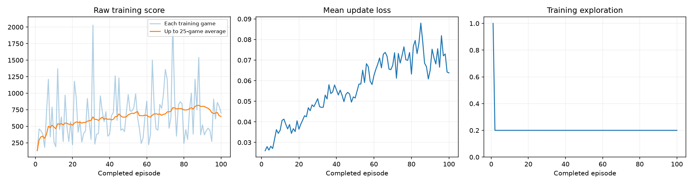
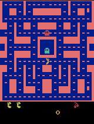

# Ms. Pac-Man DQN Training Experiment

I initialized the supplied DQN from scratch, trained it for 100 episodes, and compared its performance before and after training using the same five evaluation seeds. The mean evaluation score changed from **492 to 518 points**, an increase of **26 points**. I interpret this result using all five scores, the gameplay recordings, and the training logs together.

## How to run

1. Open the [final notebook with saved execution outputs](pacman_dqn.ipynb) in Jupyter, VS Code, or Google Colab.
2. Use a Python 3.11–3.13 kernel. The notebook's setup cell installs the required packages. For local execution, keep [pacman_player.py](pacman_player.py) beside the notebook.
3. Run every cell in order from the beginning. Save a copy of the current executed notebook first: rerunning creates a fresh model and a new results folder.
4. After execution, download the notebook with its outputs and the results ZIP. Results may differ across computing environments even with the same seeds.

## Hyperparameters and prediction before training

| Setting | Value | Reason |
|---|---:|---|
| Exploration | 0.20 | Keep 20% of training actions random after warm-up to maintain exploration. |
| Episodes | 100 | Use the classroom notebook's default training budget after a five-episode setup check confirms that execution and saving work. |
| Learning rate | 0.0001 | Use the assignment's reference value as the starting point for this experiment. |

Before training, I expected 100 episodes to improve the mean evaluation score. I planned to inspect changes in movement paths and repeated behavior in the same locations. No other training or evaluation settings were changed. The first 1,000 decisions use random actions for warm-up; exploration remains constant afterward.

## Actual training budget and environment

| Item | Recorded value |
|---|---|
| Run status | completed |
| Requested / completed episodes | 100 / 100 |
| Decisions | 62,059 |
| Learning updates | 15,265 |
| Training, periodic demonstrations, and saving time | 688.58 seconds |
| Training hardware | CPU, x86_64; no GPU used |
| Python | 3.12.14 |
| Platform | Linux-6.18.44-x86_64-with-glibc2.39 |

The elapsed time comes from `training_summary.json` and excludes installation and the initial and final evaluations. Training completed without interruption, and learning updates occurred. Jupyter communication sockets were unavailable in this workspace, so the original code cells were executed sequentially through IPython, with text and image outputs saved in the notebook. The training and evaluation rules were unchanged.

| Package | Actual version |
|---|---|
| torch | 2.14.0+cpu |
| gymnasium | 1.3.0 |
| ale-py | 0.11.2 |
| opencv-python-headless | 4.14.0.94 |
| numpy | 2.5.3 |
| matplotlib | 3.11.2 |
| Pillow | 12.3.0 |

## Evaluation under identical conditions

The baseline is an **untrained neural network**. Both evaluations used seeds 101, 202, 303, 404, and 505, exploration of 0.05, and a limit of 3,000 decisions per game. Evaluation did not update the weights or replay memory.

| Seed | Before training | After training | Change |
|---|---:|---:|---:|
| 101 | 350 | 710 | +360 |
| 202 | 500 | 470 | -30 |
| 303 | 320 | 370 | +50 |
| 404 | 800 | 330 | -470 |
| 505 | 490 | 710 | +220 |
| Mean | 492 | 518 | +26 |

Games ending at the time limit: 0/5 before training and 0/5 after training. Full results and game lengths are in [comparison.json](results/main/comparison.json). Five evaluation games are not enough to establish a general improvement in performance.

## Training dashboard

The dashboard shows raw game scores, update loss, and training exploration. The moving average of training scores generally increased before declining near the end, while loss generally increased. Loss measures prediction error and is not the same as evaluation performance; a decrease in loss alone would not establish better gameplay.

## Gameplay and observations

### Before training

### After the final training run

In the trained GIF, the agent moves through the maze and earns points by eating dots, but it still loses a life and returns to the starting position. Near the ends of the excerpts, the displayed scores are approximately 350 before training and 280 after training, whereas the corresponding full-game evaluation scores are 350 and 710. This shows why short recordings alone are insufficient for judging full-game performance. The final evaluation mean increased by 26 points, approximately 5.3%, but was lower than the five-episode setup check's mean of 730. More training did not produce consistent improvement.

The baseline GIF shows the first evaluation seed. The final GIF was selected from the five trained evaluation games by the highest full-game score. Each recording contains at most the first 20 seconds and plays at 4× speed. I therefore did not judge overall performance solely from the appearance of these two recordings.

### After 25 episodes

### After 50 episodes

### After 75 episodes

### After 100 episodes

## Observations actions and rewards

The agent observes **four 84 × 84 grayscale game screens**. Seeing several screens together provides information about movement. Its actions are the joystick inputs available in the game. Game points provide the reward. Training uses rewards clipped to the range from -1 to +1, while the table and dashboard report the original game scores.

The DQN estimates the future reward associated with each action. It randomly samples stored experiences and updates its predictions toward targets supplied by a separate target network. The scores and recordings do not establish exactly which internal concepts the network learned from the screens.

## Observed limitation and next experiment

Scores improved on three evaluation seeds but declined on two; seed 404 fell from 800 to 330 points. The model therefore showed substantial variation across situations and did not demonstrate a consistent improvement. It still lost lives in the recording after 100 training episodes. Five evaluations and short GIFs cannot establish that it learned a general ghost-avoidance ability or a particular strategy.

For the next experiment, I would change only the learning rate from 0.0001 to 0.00005, keeping exploration at 0.20, the budget at 100 episodes, and all evaluation settings unchanged, then train a fresh model. Because loss generally increased and the evaluation improvement was small, this would test whether smaller updates improve the stability of the results. It does not assume that the learning rate caused the observed limitation. I would compare all five evaluation scores and their mean, rather than relying on loss alone.

## Preliminary setup check

The five-episode setup check completed 2,550 decisions and 388 updates. Training and saving took 18.02 seconds, and the mean evaluation score changed from 492 to 730. Its individual trained scores were 440, 240, 1,640, 440, and 890. These results are kept separate from the final 100-episode results. The main experiment started from a fresh initialization rather than continuing from the setup model.

[Setup notebook](setup_check.ipynb) · [Setup evaluation scores](results/setup/comparison.json) · [Setup training summary](results/setup/training_summary.json)

## Evidence files and checkpoints

- [Final notebook](pacman_dqn.ipynb)
- [config.json](results/main/config.json)
- [training.csv](results/main/training.csv)
- [training_summary.json](results/main/training_summary.json)
- [comparison.json](results/main/comparison.json)
- [Intermediate demonstration scores](results/main/demo_scores.json)
- [Original commit and execution method](results/provenance.json)
- [Execution and file verification results](results/verification.json)

The complete results ZIP is stored at `pacman_runs/20260915_105038_502472.zip` in the assignment bundle. It contains the untrained, 25-, 50-, 75-, and 100-episode checkpoints, plus the final checkpoint. The setup run's complete ZIP is in the same folder. Keep large model files and the full ZIPs locally, and upload the notebooks and the evidence in `results/` to the public repository. Checkpoints support playback and do not contain all the state needed to resume training exactly.

## Source and submission status

This experiment uses the [classroom Pac-Man DQN](https://github.com/pepealonso95/pacman-dqn); the [original instructions](STARTER_README.md) are preserved. Uploading the public GitHub repository, checking its links in a private browser window, and submitting its URL through the course portal remain to be completed.
